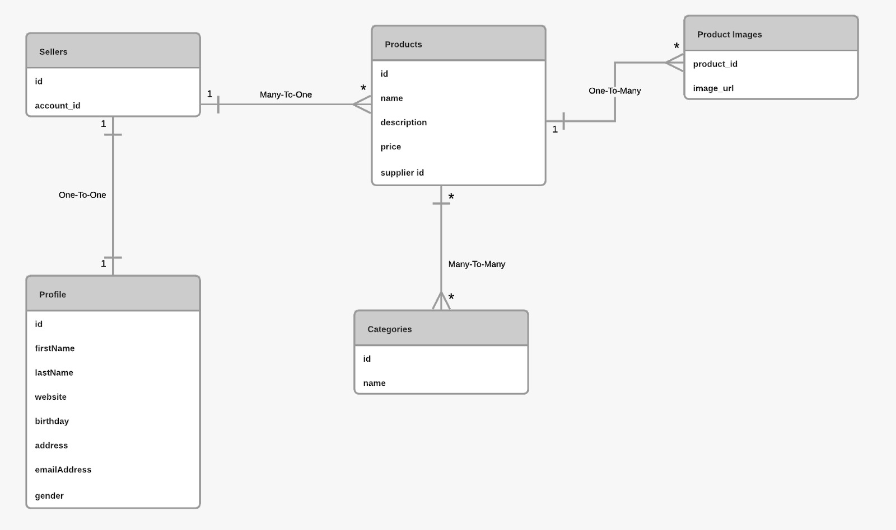

## Work Done
- In order to complete the Customer entity, I implemented a join table method of inheritance, where I created an abstract User class and made Sellers and Customers extend this class. This way, the relationship becomes one to one between the User class and Profile, which solves the problem where Profile entity requires both Customer and Seller during initialization. 
- Created entities Basket and BasketProduct. A basket can include many BasketProducts, but one BasketProduct references only one product. I hard-coded a test scenario in the main function and implemented their respective Controllers. 

## TODO
- Transaction system. 
- Instead of an entity like BasketProducts, let Basket hold an ArrayList of products and compare the speed and performance with the current solution. 

## Ön şart

Docker kurulumu işletim sistemine göre değişiyor. Docker'ı kurduktan sonra
`docker run --name postgresqldb -e POSTGRES_USER=myusername -e POSTGRES_PASSWORD=mypassword -p 5432:5432 -d postgres`
komutu ile docker içerisinde postgresql kurulumunu yapabilir;
`docker start postgresqldb`
komutu ile de db'yi başlatabilirsiniz. Bu komutlarla alakalı ayrıntılı bilgi için 
`https://hackernoon.com/how-to-install-postgresql-with-docker-quickly-ki7g363m makalesini inceleyebilirsiniz.`
Daha sonra kurduğumuz bu veri tabanına bağlanmamız gerekiyor, bunun için de DataGrip programını kullanacağız. DataGrip ücretli bir program ancak 30 günlük sürümü yetecektir. DataGrip ile tablo ekleme, tablolara veri ekleme, veriler üzerinde SQL dili ile sorgulama yapma özelliklerine kavuşacağız.
`DataGrip kurulumu için https://www.jetbrains.com/help/datagrip/installation-guide.html#standalone` 
adresindeki "Standalone Installation" adımını kullanabilirsiniz. Daha sonra DataGrip ile kurduğumuz PostgreSQL bağlantısını sağlamak için ise `https://www.jetbrains.com/help/datagrip/quick-start-with-datagrip.html#step-5-connect-to-a-database adresindeki` "Step 5. Connect to a database" maddesini uygulayabilirsiniz.

## Ödev

Öncelikle `spring-data-example` projesi altındakı projeyi refactor etmenizi ve sonrasında `Customer` entitysinin implementation'unu tamamlamanızı bekliyoruz. 
Sonrasinda ise bu customer'a sepete ürün ekleyebilme yetkinlikiği kazandırmanızı bekliyoruz. Nice to have olarak sipariş yetkinliği de kazandırabilirsiniz.

Erd:

Sunum: https://docs.google.com/presentation/d/1znxeXDMDwezcsPY7_34oFAD5jWS2bBKS_TBN_PVGs8k/edit?usp=sharing
